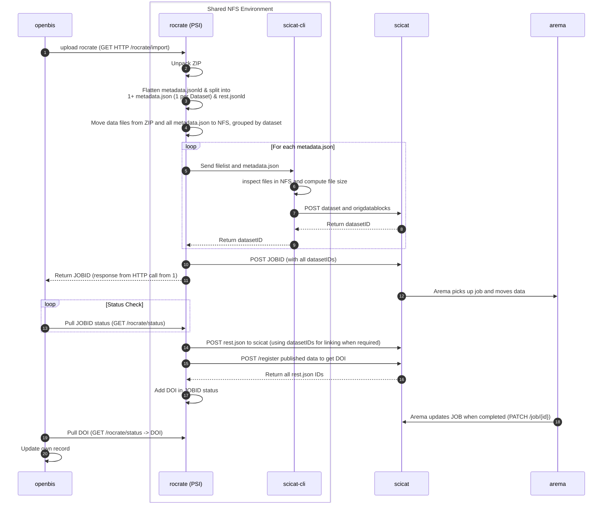

# Openbis-scicat architecture

```mermaid
sequenceDiagram
    autonumber
    participant openbis

    %% The box visually groups them as sharing the same environment
    box Transparent Shared NFS Environment
    participant rocrate as rocrate (PSI)
    participant scicat-cli
    end

    participant scicat
    participant arema

    openbis->>rocrate: upload rocrate (GET HTTP /rocrate/import)
    rocrate->>rocrate: Unpack ZIP
    rocrate->>rocrate: Flatten metadata.jsonld & split into<br/>1+ metadata.json (1 per Dataset) & rest.jsonld
    rocrate->>rocrate: Move data files from ZIP and all metadata.json to NFS, grouped by dataset

    loop For each metadata.json
        rocrate->>scicat-cli: Send filelist and metadata.json
        scicat-cli->>scicat-cli: inspect files in NFS and compute file size
        scicat-cli->>scicat: POST dataset and origdatablocks
        scicat-->>scicat-cli: Return datasetID
        scicat-cli-->>rocrate: Return datasetID
    end

    rocrate->>scicat: POST JOBID (with all datasetIDs)
    rocrate-->>openbis: Return JOBID (response from HTTP call from 1)
    scicat->>arema: Arema picks up job and moves data

    loop Status Check
        openbis->>rocrate: Pull JOBID status (GET /rocrate/status)
    end

    rocrate->>scicat: POST rest.json to scicat (using datasetIDs for linking when required)
    rocrate->>scicat: POST /register published data to get DOI
    scicat-->>rocrate: Return all rest.json IDs
    rocrate->>rocrate: Add DOI in JOBID status

    arema->>scicat: Arema updates JOB when completed (PATCH /job/{id})
    openbis->>rocrate: Pull DOI (GET /rocrate/status -> DOI)
    openbis->>openbis: Update own record
```
