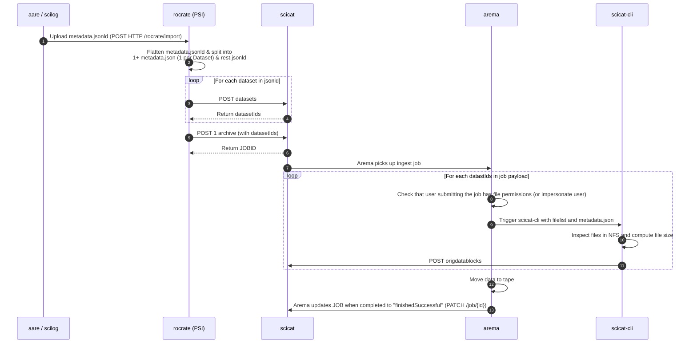

# Aare and SciLog architecture

```mermaid
sequenceDiagram
    autonumber
    participant scilog as aare / scilog
    participant rocrate as rocrate (PSI)
    participant scicat
    participant arema

    scilog->>rocrate: Upload metadata.jsonld (POST HTTP /rocrate/import)
    rocrate->>rocrate: Flatten metadata.jsonld & split into<br/>1+ metadata.json (1 per Dataset) & rest.jsonld

    loop For each dataset in jsonld
        rocrate->>scicat: POST datasets
        scicat-->>rocrate: Return datasetIds
    end
    rocrate->>scicat: POST 1 archive (with datasetIds)
    scicat-->>rocrate: Return JOBID

    scicat->>arema: Arema picks up ingest job


    loop For each datastIds in job payload
        arema->>arema: Check that user submitting the job has file permissions (or impersonate user)
        arema->>scicat-cli: Trigger scicat-cli with filelist and metadata.json
        scicat-cli->>scicat-cli: Inspect files in NFS and compute file size
        scicat-cli->>scicat: POST origdatablocks
    end

    arema->>arema: Move data to tape
    arema->>scicat: Arema updates JOB when completed to "finishedSuccessful" (PATCH /job/{id})
```
