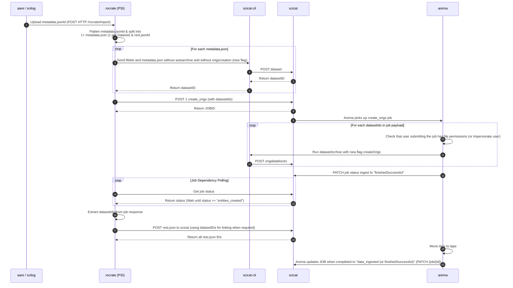

# Aare and SciLog architecture

```mermaid
sequenceDiagram
    autonumber
    participant scilog as aare / scilog
    participant rocrate as rocrate (PSI)
    participant scicat-cli
    participant scicat
    participant arema

    scilog->>rocrate: Upload metadata.jsonld (POST HTTP /rocrate/import)
    rocrate->>rocrate: Flatten metadata.jsonld & split into<br/>1+ metadata.json (1 per Dataset) & rest.jsonld

    loop For each metadata.json
        rocrate->>scicat-cli: Send filelist and metadata.json without autoarchive and without origscreation (new flag)
        scicat-cli->>scicat: POST dataset
        scicat-->>scicat-cli: Return datasetID
        scicat-cli-->>rocrate: Return datasetID
    end

    rocrate->>scicat: POST 1 create_origs (with datasetIds)
    scicat-->>rocrate: Return JOBID

    scicat->>arema: Arema picks up create_origs job

    loop For each datasetIds in job payload
        arema->>arema: Check that user submitting the job has file permissions (or impersonate user)
        arema->>scicat-cli: Run datasetArchive with new flag createOrigs
        scicat-cli->>scicat: POST origdatablocks
    end
    arema->>scicat: PATCH job status ingest to "finishedSuccessful"

    loop Job Dependency Polling
        rocrate->>scicat: Get job status
        scicat-->>rocrate: Return status (Wait until status == "entities_created")
    end

    rocrate->>rocrate: Extract datasetIds from job response

    rocrate->>scicat: POST rest.json to scicat (using datasetIDs for linking when required)
    scicat-->>rocrate: Return all rest.json IDs

    arema->>arema: Move data to tape
    arema->>scicat: Arema updates JOB when completed to "data_ingested (or finishedSuccessful)" (PATCH /job/{id})
```
